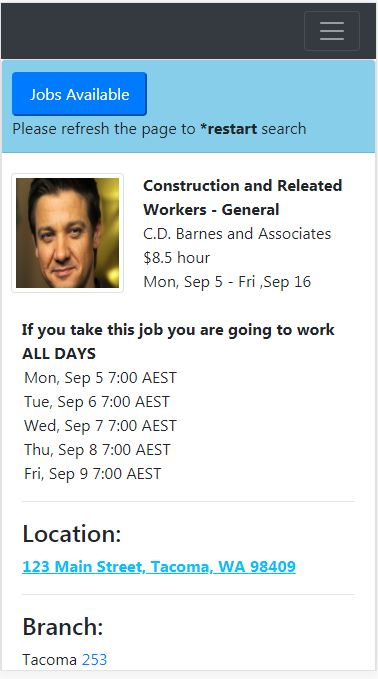

## About the app
#Angular 6 based B2B App to match on-demand workers with employers who are staffing firm customers . This is the source code of the application. The production build can be found at 
`https://github.com/deepeshdesigns/swjobs`

This project was generated with [Angular CLI](https://github.com/angular/angular-cli) version 6.0.8.

This app can be used as an interface between contract job seekers in labour market and companies look for temporary hires. 

The front experience is a mobile view of how a particular labour, who is not very tech savvy, would get to see the details of a particular job when he picks a job from list of available jobs

The application mimics calling a backend API containing available jobs based on search criteria such as :
a. Daily rates
b. Start date
c. End dates

Currently the front end only shares job search result page for a particular job a labour want to apply for / shows interest in but can be extrapolated with a listing page with list of jobs picked from the backend API

## Running version of the app
You can experience the app at `https://deepeshdesigns.github.io/swjobs/`

## Frontend of the app

## Development server

Run `ng serve` for a dev server. Navigate to `http://localhost:4200/`. The app will automatically reload if you change any of the source files.

## Code scaffolding

Run `ng generate component component-name` to generate a new component. You can also use `ng generate directive|pipe|service|class|guard|interface|enum|module`.

## Build

Run `ng build` to build the project. The build artifacts will be stored in the `dist/` directory. Use the `--prod` flag for a production build.

## Running unit tests

Run `ng test` to execute the unit tests via [Karma](https://karma-runner.github.io).

## Running end-to-end tests

Run `ng e2e` to execute the end-to-end tests via [Protractor](http://www.protractortest.org/).

## Further help

To get more help on the Angular CLI use `ng help` or go check out the [Angular CLI README](https://github.com/angular/angular-cli/blob/master/README.md).
